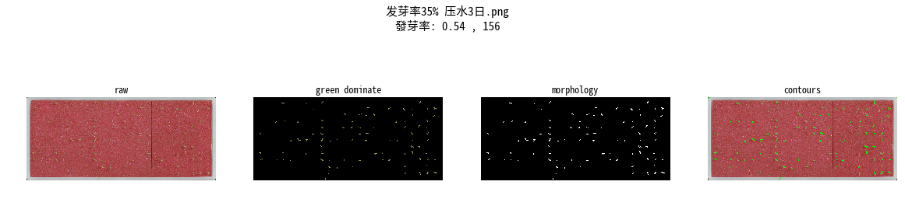
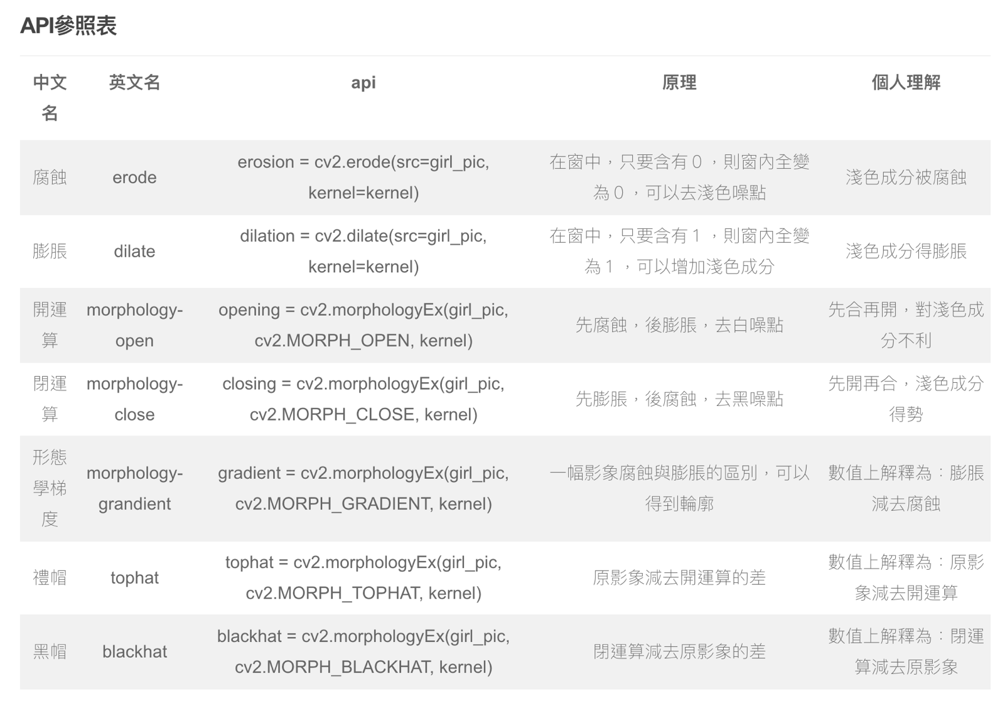

Germination dataset
---------------------------

**Data Set Characteristics:**

    :照片數量: 13 (8k照片3張, iphone照片10張)
    
    :類別: 在8k的照片中分別有(发芽率35% 压水3日), (发芽率75% 压水5日), (发芽率98% 压水7日)
    
    :source code: datasets/base.py
    
    :method: load_germination()    

**讀取數據Sample Code**
::
    from datasets import load_hotmelt
    data = load_germination()
    img = data.data_8k[0]
    info = data.data_8knames[0]

**Model Characteristics**

    :Green Domination: 透過發芽盤的底色為粉紅色, 發芽的顏色為綠色的特徵, 留下RGB中綠色特別明顯的像素點
    
    :morphology: 先膨脹，後腐蝕，去黑噪點
    
    :binary: threshold_minimum, 將圖片變成黑白照片
    
    :Contours: 找出每一個發芽點的輪廓
    

專案說明：
目前發芽率的計算由人工看一眼後大略估算, 無法精確的計算, 所以這個專案期望可以幫工廠精確計算發芽率, 得到精確的發芽率, 對於後續產量的預測很有幫助, 如果發芽率太低, 就必須盡快補種不足的數量. 在使用的技術, 並沒有使用深度學習或機器學習的方法, 單純使用影像處理的方法, 透過觀察現場的照片後, 找到一個能精確分離綠芽與粉紅色海綿的算法. 

在處理影像的技術中, morphology有許多參數可以調整, 並且對結果有一定程度的影響, 可以對其中的參數深入了解後優化現有設定

Reference: 
- OpenCV 形態學轉換 (`link1`_)

.. _link1: https://www.itread01.com/content/1546100107.html

