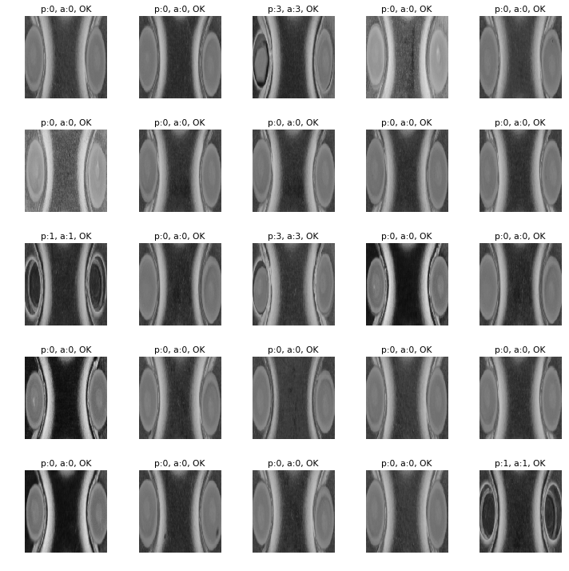
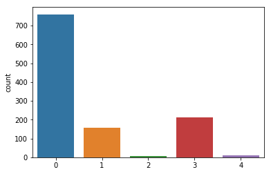

Hotmelt defect dataset
---------------------------

**Data Set Characteristics:**

    :照片數量: 1146
    
    :類別數量: 5
    
    :source code: datasets/base.py
    
    :method: load_hotmelt()    

**讀取數據Sample Code**

::

    from datasets import load_hotmelt
    data = load_hotmelt()
    data = data.data
    
::

    from datasets import load_hotmelt_generator
    data = load_hotmelt_generator()
    imgAug = ImageDataGenerator(
        samplewise_center=True, samplewise_std_normalization=True,
        vertical_flip=True, horizontal_flip=True,
        width_shift_range=0.02, height_shift_range=0.02,
        zoom_range =[0.95,1.05],
    )
    def augfun(batch_img, batch_y, batch_size):
        with graph1.as_default():
            with session1.as_default():
                roi_imgs = np.array(list(map(lambda x: yolo.predict_roi(Image.fromarray(x.astype(np.uint8))), batch_img)))
        gen = imgAug.flow(roi_imgs, batch_y, batch_size=batch_size)
        X, Y = gen.next()
        return X,Y
    x,y = next(data.dataGenerator(10, augfun))

**Model Characteristics**

    :Object Detection Model: DenseNet169 (keras ver.)
    
    :input size: (224,224,3)
    
    :output size: 5 (4 defect type + 1 ok)
    
    :pretrain: imagenet pretrain model, keras builtin weight
    
    :output model format: h5 and tflite
    
    :source code: img_hotmelt.ipynb

**Training Hyperparameter**  

    :lose: categorical_crossentropy
    
    :optimizer: sgds
    
    :batch size: 19
    
    :EarlyStopping: patience=100
    
    :ReduceLROnPlateau: factor=0.5, patience=5
    
    :epoch: 50

    :image augmentation: samplewise_center, samplewise_std_normalization, vertical_flip, horizontal_flip, width_shift_range, height_shift_range, zoom_range

專案說明：
在這個專案, 因為現場已經有一台基恩士的AOI設備, 但是產線為了保證零漏檢, 所以在檢測規格的設定上相對嚴格許多, 造成了很高的過殺率, 最嚴重時可以高達70%的過殺, 所以引入的深度學習的技術, 對AOI判斷Defect的照片進行第二次判斷, 期望從中再把True Detect和Pass分開, 降低作業員複檢數量, 釋放現場人工檢測的人力.

現場的照片類別數量並不平衡, 訓練資料的類別數量比例如下圖所示

