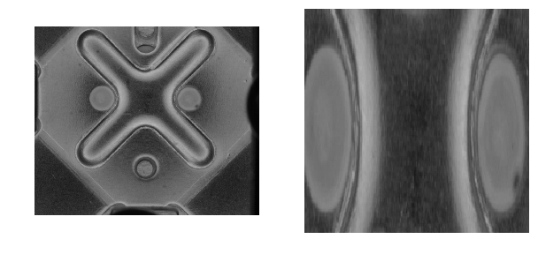

Hotmelt ROI dataset
---------------------------

**Data Set Characteristics:**

    :照片數量: 641
    
    :類別數量: 1
    
    :source code: datasets/base.py
    
    :method: load_hotmeltyolodata()    

**讀取數據Sample Code**

::

    from datasets import load_hotmeltyolodata
    data = load_hotmeltyolodata()
    lines = data.data

**Model Characteristics**

    :Object Detection Model: YOLOv3 (keras ver.)
    
    :input size: (416,416,3)
    
    :output: boxes, in [(upper, left, lower, right),] format
    
    :pretrain: imagenet pretrain model, keras builtin weight
    
    :anchors: Default
    
    :output model format: h5
    
    :source code: img_hotmelt_ROI.ipynb
    
    :需要自己實作的部分: yolov3

**Training Hyperparameter**  

    :lose: {'yolo_loss': lambda y_true, y_pred: y_pred}
    
    :optimizer: adam
    
    :batch size: 7
    
    :EarlyStopping: patience=10
    
    :ReduceLROnPlateau: factor=0.5, patience=10
    
    :epoch: 25+50

**Inference Sample Code**

::
    from utils import overSampling, YOLOV3
    from datasets import load_hotmelt
    from PIL import Image, ImageFont, ImageDraw
    data = load_hotmelt()
    yolo=YOLOV3()
    display(Image.fromarray(data.data[0]))
    display(yolo.predict_roi(Image.fromarray(data.data[0])))

專案說明：
從十字彈片(下圖左)的AOI影像中擷取出中間兩個熱熔點的區域(下圖右), 因為用傳統影像比對的方法速度太慢, 所以改用yolo的方式讓model自動學習且可以提高辨識速度. 

Reference: 
- YOLO (`link1`_)
- keras-yolo3 (`link2`_)

.. _link1: https://pjreddie.com/darknet/yolo/
.. _link2: https://github.com/qqwweee/keras-yolo3