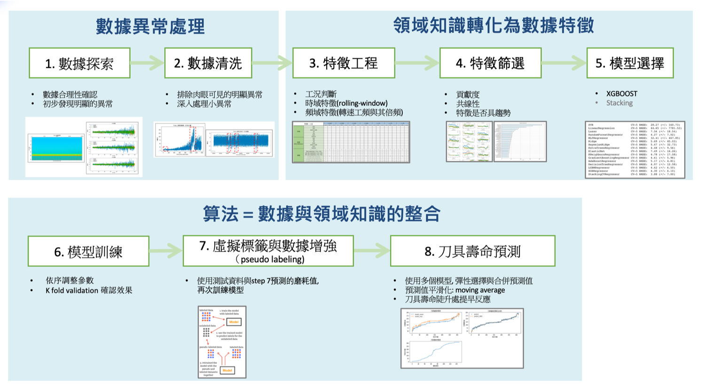

Foxconn IAI CNC Competition dataset
-------------------------------------

**Data Set Characteristics:**

    :競賽數據資訊: 竞赛包含三个刀具的数据，Train_A, Train_B, Test。数据 Train_A, Train_B 是训练用数据；数据 Test 是测试用数据。 每个训练数据档案都包含感測器數據與刀具磨耗量測

    :铣切的種類: 這次的比賽應該是平面铣切        
    
    :感測器數據欄位:
    
        - x方向力量
        - y方向力量
        - z方向力量
        - x方向震動
        - y方向震動
        - z方向震動
        - 音洩讯号的均方根值
        
    :刀具磨耗量測欄位(每次铣切后的磨损数据):
    
        - flute1
        - flute2
        - flute3    
    
    :一些额外关于数据采集的信息：
    
        - 数据收集自一把六毫米碳化钨三刃球型立铣刀
        - 主轴转速是 10400 RPM
        - 料件进给速度是一分钟 1555 毫米 (mm/min)
        - Y方向切削 深度是 0.125 毫米 (mm)
        - Z方向切削 深度是 0.2 毫米 (mm)
        - 数据采集频率是 50 KHz       
        - 每把刀具進行315次的铣切, 每次铣切後都量測磨耗值
        
        
**讀取數據Sample Code**

::

    from datasets import load_iaicnc
    datasets = load_iaicnc()

**Featuring**
    
    :數據清洗:Hampel Filter, 滑動窗口與中值濾波的結合使用
    
    :工況切割: cut-in與cut-out區域的數據變動都很小, 而stable區域的數據變動很大, 這邊採用rolling-window搭配標準差辨識cut-in與cut-out區域

    :Rolling Window: 直接整段數據取特徵值(最大, 最小, etc.), 很容易受到outlier影響, 所以這邊採用rolling-window將數據分割成N塊計算特徵值, 再從N個特徵值取平均
    
    :時域特徵:
    
        - 平均值, 標準差, 最大, 最小, 最大與最小的差距
        - 一階變化率的 平均值, 標準差, 最大, 最小, 最大與最小的差距
    
    :頻域特徵:
    
        - 主要頻率174, 374, 521的震幅 
        - 主要頻率的左邊頻率173, 373, 523的震幅 
        - 主要頻率的右邊頻率175, 375, 522的震幅 
        - 0~1000頻帶的rms, mean, max, min, (min-max), 
        - 1000~ 頻帶的rms, mean, max, min, (min-max), 
        - snr

**Model Characteristics**

    :xgboost:
    
        - 基於Gradient boosting的優化版本
        - 優化损失函数, 減少訓練過程中的過擬合(over-fitting)
        - 引入很多工程上的优化，例如支持并行计算、提高计算效率、处理稀疏训练数据等等。
        - 於2014年由陈天奇博士提出

**Hyperparameter Configuration**  

    :xgboost模型的訓練超參數:
    
        - max_depth=5
        - reg_lambda=0.9
        - learning_rate=0.03
        - subsample=0.9
        - colsample_bylevel=0.9
        - colsample_bytree=0.9
        
    :在預測階段的手動調整:
    
        - 頻域的特徵在200左右突然往上抖升, 所以200後的預測值嘗試用max版模型的model預測結果
        - 對預測的磨耗值平滑化(moving average, window size=5)
        - 可洗切次數在磨耗限制60~70時陡升, 嘗試使用後面兩期修正lag(-2)
            - 在可铣切次數陡升處, 較容易造成較大的預測誤差
            - Late Prediction會被大量扣分

競賽說明:
- 首先预估三把刀各自在每次铣切之后的磨损
- 假設磨损的限制是51，计算三把刀各自可以承受的铣切次数，取其三个次数的最大值。
- 将磨损限制由51每次+1提升至200，会得到150笔预估的最大铣切次数。
- 提交150行的预估的結果(txt档案)
        
        
實作說明(Jay)：
透過傳感器數據, 評估刀具的磨耗程度, 並預測刀具的可铣切次数. 這份Sample Code使用的是監督式的學習, 模型選擇為xgboost, 此方法只適用於這個競賽的這份數據, 並不適合真實場景上線使用, 因為其中需要調整的超參數太多, 且不知道是否這份數據調整好的超參數能否適用於其他刀具. 在真實場景中, 還是偏好選擇非監督式的模型. 

..  image:: https://i.imgur.com/8zGYfwA.png
    :height: 400
    :width: 400
    
..  image:: https://i.imgur.com/p9tbwQH.png
    :height: 400
    :width: 400    
    
..  image:: https://i.imgur.com/NtRHrYE.png
    :height: 400
    :width: 400        

    
    
    