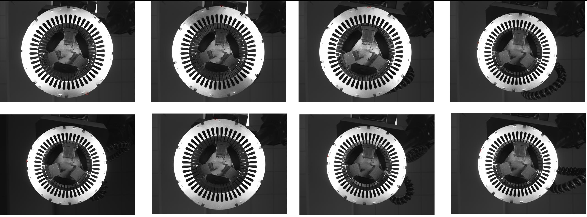

Motor Anchor dataset
---------------------------

**Data Set Characteristics:**

    :原始照片數量: 10
        
    :類別數量: 1 (定位點)
    
    :Augmentation後照片數量: 160
    
        - 因為只有拿到20張照片, OK與NG各10張, 所以用OK的10張照片當作訓練資料, NG的10張照片不加入訓練, 當作測試資料.
        
        - 但是只有10張照片, 不足以用來訓練一個深度學習模型, 所以利用Augmentor這個套件將每張照片隨機旋轉/翻轉, 將訓練資料擴充至150張, 旋轉後的照片會些微的放大, 也可以更增加照片之間的差異性.

使用套件Augmentor, Sample code:
    
    :source code: datasets/base.py
    
    :method: load_motoranchordata()    

**讀取數據Sample Code**

::

    from datasets import load_motoranchordata
    data = load_motoranchordata(get_random_data, preprocess_true_boxes)
    lines = data.data
    
**Image Augmentation Sample Code**

::

    import Augmentor, os, sys
    p = Augmentor.Pipeline("Img/Training")
    p.rotate(probability=0.99, max_left_rotation=5, max_right_rotation=5)
    p.rotate_random_90(0.76)
    p.sample(150)

**Model Characteristics**

    :Object Detection Model: YOLOv3 (keras ver.)
    
    :input size: (416,416,3)
    
    :output: boxes, in [(upper, left, lower, right),] format
    
    :pretrain: imagenet pretrain model, keras builtin weight
    
    :anchors: Default
    
    :output model format: h5
    
    :source code: img_motoranchor.ipynb
    
    :需要自己實作的部分: yolov3

**Training Hyperparameter**  

    :lose: {'yolo_loss': lambda y_true, y_pred: y_pred}
    
    :optimizer: adam
    
    :batch size: 7
    
    :EarlyStopping: patience=10
    
    :ReduceLROnPlateau: factor=0.5, patience=10
    
    :epoch: 25+50

專案說明：
從馬達的照片中擷取出定位點讓機械手臂抓取, 因為用傳統影像比對的方法速度太慢, 所以改用yolo的方式讓model自動學習且可以提高辨識速度. 

Reference: 
- YOLO (`link1`_)
- keras-yolo3 (`link2`_)
- 筆記 (`link3`_)

.. _link1: https://pjreddie.com/darknet/yolo/
.. _link2: https://github.com/qqwweee/keras-yolo3
.. _link3: https://hackmd.io/@JHSU/r1-gN6OlH

