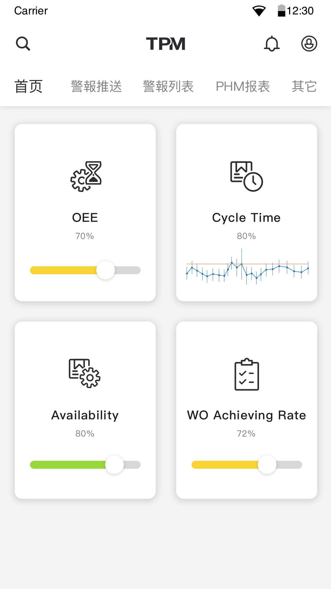

成型機案例數據
---------------------------

**Data Set Characteristics::**

    :控制器數據: 從控制器取出的螺桿位置, 油壓缸壓力, 料管溫度的數據統計值, 總共有44種數據
    
    :機台狀態燈號: 從控制器的機台狀態數據, 定義機台燈號
    
    :spccol_mapping: PLC數據欄位的中英文對照表
    

**讀取數據Sample Code**

::

    data= load_oee()

**Model Characteristics**
    
    :稼動率: 利用機台狀態燈號, 計算機台的工作時間比例
    
    :達成率: 實際完成模次/理想應完成模次
    
    :週期時間: 完成每一模次的時間

專案說明：
與TPM合作的Phase I, 透過控制器數據與機台狀態燈號, 實時計算稼動率, 達成率, 週期時間

