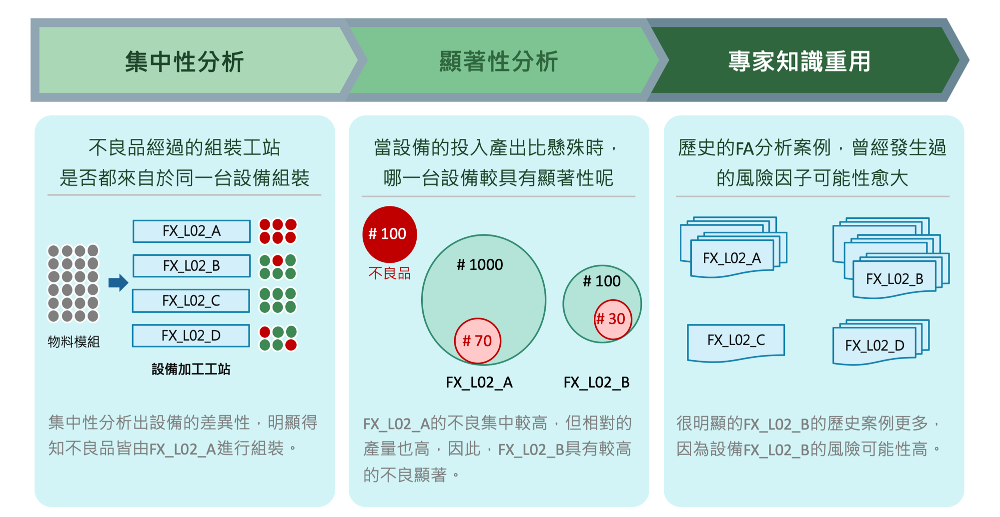

RCA dataset
---------------------------

**Data Set Characteristics:**

    :Number of Instances:
    
        - test: 3468
        - sfc: 3308
        - parts: 16544
        
    :Number of Attributes: 
    
        - test: 13
        - sfc: 11
        - parts: 11
    
    :Test Attributes information:
    
        - SN: UUT序號
        - Station: 測試工站
        - Stationcode: 測試工站ID
        - Machine: 測試設備ID
        - start_time: 測試開始時間
        - end_time: 測試結束時間
        - isTestFail: 是否測試Fail
        - symptom: 測試徵狀
        - desc: 測試結果說明
        - uploadtime: 紀錄上傳時間
        - emp: 空欄位
        - ver1: 測試軟體版本號
        - ver2: 測試軟體版本號
        
    :SFC Attributes information: 
    
        - ID: SFC ID
        - SN: 產品序號
        - WO: 工單
        - HH_Part: 鴻海料號
        - CUST_Part: 客戶料號
        - assembline: 組裝線體
        - scantime: 掃描barcode時間
        - na1: 空欄位
        - na2: 空欄位 
        - product: 產品名稱
        - floor: 組裝樓層
        
    :PARTS Attributes information:  
    
        - ID: SFC ID
        - PARTSN: 物料序號
        - scantime: 掃描barcode時間
        - opid: 作業員工號
        - assembly_station: 組裝工站
        - part: 物料代號
        - HH_Part: 鴻海料號
        - CUST_Part: 客戶料號
        - line: 組裝線體
        - na1: 空欄位
        - na2: 空欄位
        
    :source code: datasets/base.py
    
    :method: load_rca()

**讀取數據Sample Code**

::

    from datasets import load_rca
    data = load_rca() 
 
 
**Model Characteristics/Flow**

    :關注工站: 計算測試工站良率, 關注良率最差的工站
    
    :關注Symptom: 從良率最差工站的不良品中，計算Symptom不良數量, 關注不良數量最多的Symptom
    
    :組大表: 分別從三份數據裡面將可分析的人機料欄位放入同一張大表
    
        - test_df: 測試工站+測試設備
        - sfc_df: 工單號
        - part_df: VendorID, DateCode    
        
    :物料序號編碼規則解析: 根據廠商自訂的序號編碼規則將序號解析為廠商代碼(VendorID)與出廠日期(DateCode)
    
    :標記是否為Symptom Fail: 在大表中多加一個欄位, 標記是否為Symptom (Scan3StreakFlare) Fail的序號(ID)
    
    :人機料集中性運算: 大表中每一個欄位都是一項人機料風險因子, 依序計算每一項風險因子的不良品分佈的統計指標
    
    :集中性指標:
    
        - 不良數量
        - 不良總數
        - 產出數量
        - 產出總數
        - 集中性
        - 產出比例
    
    :source code: img_rca.ipynb    

 
專案說明：
工廠內的系統組裝線, 因為產品越來越複雜, 組裝工藝也跟著變得更複雜, 造成生產一個產品必須經過十幾個組裝與測試站點, 當測試不通過時, 生產組長難以快速判斷造成測試不通過的原因. 這個專案假設造成測試不良的原因為測試前的物料組裝過程, 可能是作業員組裝手法的因素(人), 也可能是自動化組裝設備的異常(機), 也可能是來料異常(料), 透過集中性分析的方式, 快速的歸納測試不良的手機, 再上訴的三大原因與站點中, 是否存在共通的風險因子, (例如測試不良品的某一顆螺絲, 都是由同一個作業員組裝), 再利用統計的顯著性檢定, 將眾多的風險因子篩選與排序, 提供給用戶最有可能的三大風險因子, 加速生產主管的問題排查速度.  

Issue: 
    - Issue:
        - SFC_ID和SN一樣, 無法用不同的SFC_ID辨識維修前後的物料, 不過可以用時間先後順序辨識最新組裝物料
        - SFC_ID和SN一樣, 所以SFC這張表沒有用?

    - Test_Data可用欄位：測試工站+測試設備
    - SFC_Data可用欄位：WO
    - PART_Data可用欄位：part+partsn, part+opid

Reference:
- 集中性分析筆記 (`link1`_)

.. _link1: https://hackmd.io/fkemgqRbQlOQmGK9lk1jdA
