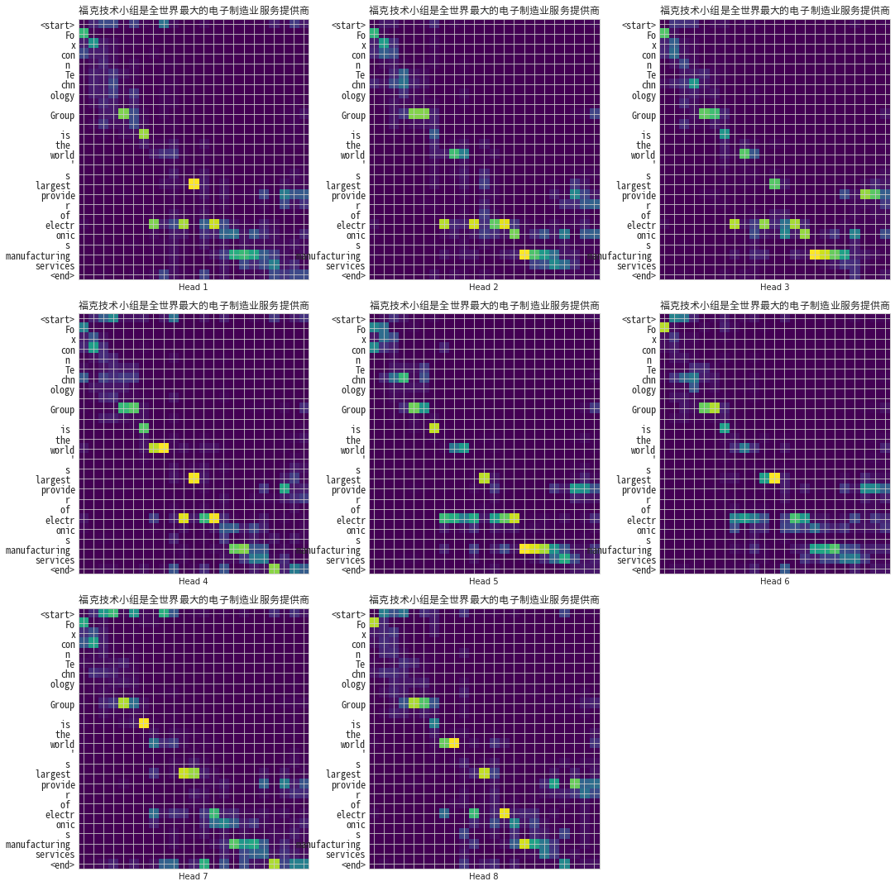

WMT2019 dataset
---------------------------

**Data Set Characteristics:**

    :中英翻譯語料庫:
    
        - 聯合國數據：uncorpus_v1
        - 維基百科標題：wikititles_v1
        - 新聞評論：newscommentary_v14  
        - ...
        
    :數據格式: TFRecord, 中英文配對的tuple list
    
    :預建立中文字典: 字典大小：4799
    
    :預建立英文字典: 字典大小：8188
    
    :數據前處理:
    
        - BOS/EOS: 在example的前後加入BOS, EOS索引值
        - filter: 過濾掉長度超過40的example
        - padding: padded_batch 函式能幫我們將每個batch裡頭的序列都補0到跟當下 batch 裡頭最長的序列一樣長
        - shuffle: 將examples洗牌確保隨機性
    
    :source code: datasets/base.py
    
    :method: load_newscommentary_v14()

**讀取數據Sample Code**

::
    from datasets import load_newscommentary_v14
    data = load_newscommentary_v14() 
    
 
**Model Characteristics/Flow**

    :embedding: 將 Q、K 以及 V 這三個張量先個別轉換到 d_model 維空間
    
    :padding mask: 遮住 <pad> token 不讓所有子詞關注
    
    :look ahead mask: 遮住 Decoder 未來生成的子詞不讓之前的子詞關注
    
    :multi-head: 再將其拆成多個比較低維的 depth 維度 N 次以後
    
    :scaled dot product attention: 將這些產生的小 q、小 k 以及小 v 分別丟入前面的注意函式得到 N 個結果
    
    :還原: 接著將這 N 個 heads 的結果串接起來，最後通過一個線性轉換就能得到 multi-head attention 的輸出

    :位置編碼（Positional Encoding, PE): 實作上是直接加到最一開始的英文 / 中文詞嵌入向量（word embedding）裡頭。其直觀的想法是想辦法讓被加入位置編碼的 word embedding 在 d_model 維度的空間裡頭不只會因為語義相近而靠近，也會因為位置靠近而在該空間裡頭靠近
    
    :Encoder Layer: MHA/Add&Norm/FNN/Add&Norm
    
    :Decoder Layer: MHA1/Add&Norm/MHA2/Add&Norm/FNN/Add&Norm
    
    :Encoder: 輸入的詞嵌入層/位置編碼/N個Encoder layers
    
    :Decoder: 輸入的詞嵌入層/位置編碼/N個Decoder layers
    
    :Transfomer: 把Encoder和Decoder串起來
    
        - 輸入：
        
            - 英文序列：（batch_size, inp_seq_len）
            - 中文序列：（batch_size, tar_seq_len）
            
        - 輸出：
        
            - 生成序列：（batch_size, tar_seq_len, target_vocab_size）
            - 注意權重的 dict
    
    :source code: text_transformer.ipynb    

**Hyper Parameters**

    :num_layers: 決定 Transfomer 裡頭要有幾個 Encoder / Decoder layers (paper default 6)
    
    :d_model: 決定我們子詞的 representation space 維度 (paper default 512)
    
    :num_heads: 要做幾頭的自注意力運算
    
    :dff: 決定 FFN 的中間維度 (paper default 2048)
    
    :dropout_rate: 預設 0.1，一般用預設值即可
    
    :input_vocab_size: 輸入語言（英文）的字典大小
    
    :target_vocab_size: 輸出語言（中文）的字典大小
    
..  image:: https://leemeng.tw/theme/images/left-nav/transformer.jpg
    :height: 400
    :width: 400
    

 
專案說明：
自注意力機制, Transformer實作

Reference:
- 李宏毅 Transformer (`link2`_)
- LeeMeng Transformer實作 (`link1`_)

.. _link2: https://youtu.be/ugWDIIOHtPA
.. _link1: https://leemeng.tw/neural-machine-translation-with-transformer-and-tensorflow2.html#top
